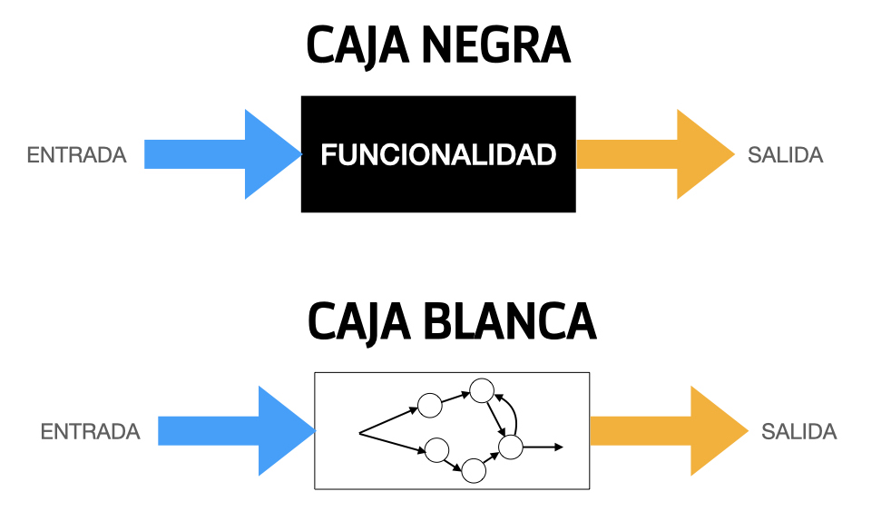
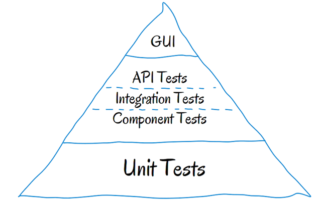
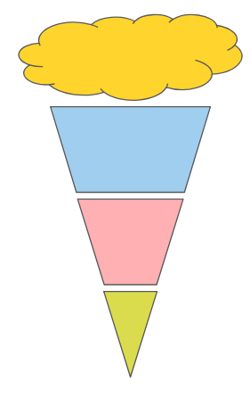

# Testeo de aplicaciones desarrolladas con Spring (primera parte)

# TEORÍA

- [Testeo de aplicaciones desarrolladas con Spring (primera parte)](#testeo-de-aplicaciones-desarrolladas-con-spring-primera-parte)
- [TEORÍA](#teoría)
  - [1. Introducción](#1-introducción)
  - [2. Manual vs Automated testing](#2-manual-vs-automated-testing)
  - [3. Planificación de las pruebas](#3-planificación-de-las-pruebas)
  - [4. Tipos de pruebas según el enfoque](#4-tipos-de-pruebas-según-el-enfoque)
  - [5. Clasificación de pruebas según lo que verifican.](#5-clasificación-de-pruebas-según-lo-que-verifican)
    - [5.1 Pruebas funcionales](#51-pruebas-funcionales)
    - [5.2 Pruebas no funcionales](#52-pruebas-no-funcionales)
    - [5.3 Pruebas aleatorias](#53-pruebas-aleatorias)
  - [6. Planificación y ejecución de las pruebas](#6-planificación-y-ejecución-de-las-pruebas)
    - [6.1 Casos de prueba](#61-casos-de-prueba)
    - [6.2 Plan de pruebas](#62-plan-de-pruebas)
      - [6.2.1 La famosa pirámide de Cohn y la dura realidad](#621-la-famosa-pirámide-de-cohn-y-la-dura-realidad)
- [PRÁCTICA](#práctica)
  - [1. Introducción](#1-introducción-1)
  - [2. Pruebas unitarias con JUnit 5](#2-pruebas-unitarias-con-junit-5)
    - [2.1 Dependencias para usar JUnit 5](#21-dependencias-para-usar-junit-5)
    - [2.2 Mi primer test](#22-mi-primer-test)
    - [2.3 Anotaciones](#23-anotaciones)
    - [2.4 Ciclo de vida](#24-ciclo-de-vida)
    - [2.5 Aserciones](#25-aserciones)
    - [2.6 Asunciones](#26-asunciones)
    - [2.7 Test de Excepciones](#27-test-de-excepciones)
    - [2.8 Test parametrizados](#28-test-parametrizados)
    - [2.8.1 Argumentos](#281-argumentos)
    - [2.9 Test suites](#29-test-suites)
    - [2.10 Test dinámicos](#210-test-dinámicos)
  - [3. Uso de JUnit 5 con una librería de asertos](#3-uso-de-junit-5-con-una-librería-de-asertos)
    - [3.1 Uso de Hamcrest con JUnit 5](#31-uso-de-hamcrest-con-junit-5)
- [Bibliografía](#bibliografía)

## 1. Introducción

Muchas veces, cuando trabajamos de manera independiente en proyectos pequeños, no tenemos la necesidad de (o el cliente no cuenta con el presupuesto para) escribir pruebas automatizadas.

Sin embargo, al empezar a trabajar en proyectos más grandes e integrarnos a equipos de trabajo más amplios, notamos que muchas veces se habla de distintos tipos de tests.

Aunque suene increíble, muchas veces como desarrolladores tendemos a desarrollar nuevas características y no conocemos muy bien lo que hace el equipo de QA (aseguramiento de calidad), y no preguntamos, ya sea por falta de tiempo o porque no queremos admitir lo poco que sabemos del tema.

Y así el tiempo avanza y no aprendemos las diferencias entre los tipos de testing que existen. Pero esto se acaba hoy.

Aunque no vamos a escribir ni realizar todos los tipos pruebas enumerados en este tema, sí que vamos revisar qué tipos existen y qué busca conseguirse con estas pruebas: para conocer mejor sus diferencias, y no sentirnos perdidos cuando estos conceptos sean usados en una conversación.

## 2. Manual vs Automated testing

De manera general, lo primero que debemos tener en cuenta es que existen pruebas de software manuales y pruebas de software automatizadas.

Las pruebas manuales son llevadas a cabo por personas, quienes navegan e interactúan con el software (usando herramientas adecuadas para cada caso).

Estas pruebas resultan costosas, ya que se requiere contar con un profesional encargado de esta labor; para configurar un entorno y así mismo ejecutar las pruebas.

Como es de esperarse, estas pruebas están expuestas a errores humanos: por ejemplo, se pueden cometer errores tipográficos u omitir pasos durante la prueba.

Las pruebas automatizadas, por el contrario, son realizadas por máquinas, que ejecutan un *"test script"* que ya ha sido escrito previamente.

Estos tests (o pruebas) pueden variar mucho en cuanto a complejidad:

- desde verificar que el método de una clase específica funcione correctamente,
- hasta asegurar que una secuencia de acciones complejas en la UI se lleven acabo correctamente y devuelvan los resultados esperados.

Estas pruebas son más rápidas y confiables que las que se llevan a cabo manualmente – pero la calidad de estas pruebas automatizadas depende de qué tan bien escritos se encuentren los *"tests scripts"* (código que determina qué es lo que se hará en la prueba).

_Automated testing_ es un componente clave para continuous integration y continuous delivery, y es una excelente manera de escalar tus procesos de QA (quality assurance, aseguramiento de calidad) a medida que agregas nuevas características a tu aplicación.

Aún así, son importantes las pruebas manuales para lo que se conoce como "exploratory testing".

## 3. Planificación de las pruebas

Durante todo el proceso de desarrollo de software, desde la fase de diseño, en la implementación y una vez desarrollada la aplicación, es necesario realizar un conjunto de pruebas (Proceso que permite verificar y revelar la calidad de un producto software. Se utilizan para identificar posibles fallos de implementación, calidad o usabilidad de un programa), que permitan verificar que el software que se está creando, es correcto y cumple con las especificaciones impuesta por el usuario.

En el proceso de desarrollo de software, nos vamos a encontrar con un conjunto de actividades, donde es muy fácil que se produzca un error humano. Estos errores humanos pueden ser: una incorrecta especificación de los objetivos, errores producidos durante el proceso de diseño y errores que aparecen en la fase de desarrollo.

Mediante la realización de pruebas se software, se van a realizar las tareas de verificación (Proceso por el que se comprueba que el software cumple los requisitos especificados) y validación (Proceso que comprueba si el software hace lo que el usuario deseaba. Tiene que estar verificado) del software. La **verificación** es la comprobación que un sistema o parte de un sistema, cumple con las condiciones impuestas. Con la verificación se comprueba si la aplicación se está construyendo correctamente. La **validación** es el proceso de evaluación del sistema o de uno de sus componentes, para determinar si satisface los requisitos especificados.

## 4. Tipos de pruebas según el enfoque

No existe una clasificación oficial o formal, sobre los diversos tipos de pruebas de software. En la ingeniería del software, nos encontramos con dos enfoques fundamentales:

* Prueba de la **Caja Negra** (Black Box Testing): cuando una aplicación es probada usando su interfaz externa, sin preocuparnos de la implementación de la misma. Aquí lo fundamental es comprobar que los resultados de la ejecución de la aplicación, son los esperados, en función de las entradas que recibe.
* Prueba de la **Caja Blanca** (White Box Testing): en este caso, se prueba la aplicación desde dentro, usando su lógica de aplicación.



Una prueba de tipo Caja Negra se lleva a cabo sin tener que conocer ni la estructura, ni el funcionamiento interno del sistema. Cuando se realiza este tipo de pruebas, solo se conocen las entradas adecuadas que deberá recibir la aplicación, así como las salidas que les correspondan, pero no se conoce el proceso mediante el cual la aplicación obtiene esos resultados.

En contraposición a lo anterior, una prueba de Caja Blanca, va a analizar y probar directamente el código de la aplicación. Como se deriva de lo anterior, para llevar a cabo una prueba de Caja Blanca, es necesario un conocimiento específico del código, para poder analizar los resultados de las pruebas.

## 5. Clasificación de pruebas según lo que verifican.

### 5.1 Pruebas funcionales

Las pruebas funcionales siguen el enfoque de las pruebas de Caja Negra. Comprenderían aquellas actividades cuyo objetivo sea verificar una acción específica o funcional dentro del código de una aplicación. Las pruebas funcionales intentarían responder a las preguntas ¿puede el usuario hacer esto? o ¿funciona esta utilidad de la aplicación?

Su principal cometido, va a consistir, en comprobar el correcto funcionamiento de los componentes de la aplicación informática. Para realizar este tipo de pruebas, se deben analizar las entradas y las salidas de cada componente, verificando que el resultado es el esperado. Solo se van a considerar las entradas y salidas del sistema, sin preocuparnos por la estructura interna del mismo.

Si por ejemplo, estamos implementando una aplicación que realiza un determinado cálculo científico, en el enfoque de las pruebas funcionales, solo nos interesa verificar que ante una determinada entrada a ese programa el resultado de la ejecución del mismo devuelve como resultado los datos esperados. Este tipo de prueba, no consideraría, en ningún caso, el código desarrollado, ni el algoritmo (Conjunto ordenado de pasos a seguir para la resolución de un problema), ni la eficiencia, ni si hay partes del código innecesarias, etc.

Algunos tipos de pruebas funcionales son:

- **Pruebas de unidad o pruebas unitarias**: Con ella se va a probar el correcto funcionamiento de un módulo de código.
- **Pruebas de integración**: se realizan una vez pasadas las pruebas unitariasy lo que prueban es que los elementos unitarios que componen el softare funcionan correctamente probándolos en grupo.
- **Pruebas de humo**:son pruebas que verifican la funcionalidad básica de una aplicación. Su objetivo es asegurar que las características más importantes del sistema funcionan como se espera. Los smoke tests pueden ser muy útiles justo después de construir una nueva versión de nuestra aplicación, para decidir si estamos listos para ejecutar pruebas más costosas, o justo después de un proceso de deployment, para asegurar que la aplicación está funcionando adecuadamente en el nuevo entorno desplegado. Tienen lugar entre las pruebas de integración y las pruebas de regresión. Y están ahí para verificar que la funcionalidad principal del sitio opera como es debido.
> Se dice que el término "prueba de humo" tiene su origen en la fontanería. Si se podía ver humo saliendo de una tubería, significaba que tenía fugas y era necesario hacer reparaciones.
- **Pruebas de regresión**: Son cualquier tipo de pruebas de software que intentan descubrir las causas de nuevos errores, carencias de funcionalidad, o divergencias funcionales con respecto al comportamiento esperado del software, inducidos por cambios recientemente realizados en partes de la aplicación que anteriormente al citado cambio no eran propensas a este tipo de error. Esto implica que el error tratado se produce como consecuencia inesperada del citado cambio en el programa.

### 5.2 Pruebas no funcionales

Son pruebas encargadas de verificar requisitos no funcionales, como por ejemplo la disponibilidad, accesibilidad, usabilidad, mantenibilidad, seguridad, rendimiento, ..

- **Pruebas de carga**: Este es el tipo más sencillo de pruebas de rendimiento. Una prueba de carga se realiza generalmente para observar el comportamiento de una aplicación bajo una cantidad de peticiones esperada. Esta carga puede ser el número esperado de usuarios concurrentes utilizando la aplicación y que realizan un número específico de transacciones durante el tiempo que dura la carga. Esta prueba puede mostrar los tiempos de respuesta de todas las transacciones importantes de la aplicación. Si la base de datos, el servidor de aplicaciones, etc también se monitorizan, entonces esta prueba puede mostrar el cuello de botella en la aplicación.
- **Prueba de estrés**: Esta prueba se utiliza normalmente para romper la aplicación. Se va doblando el número de usuarios que se agregan a la aplicación y se ejecuta una prueba de carga hasta que se rompe. Este tipo de prueba se realiza para determinar la solidez de la aplicación en los momentos de carga extrema y ayuda a los administradores para determinar si la aplicación rendirá lo suficiente en caso de que la carga real supere a la carga esperada.
- **Prueba de estabilidad**: Esta prueba normalmente se hace para determinar si la aplicación puede aguantar una carga esperada continuada. Generalmente esta prueba se realiza para determinar si hay alguna fuga de memoria en la aplicación.
- **Prueba de picos**: La prueba de picos, como el nombre sugiere, trata de observar el comportamiento del sistema variando el número de usuarios, tanto cuando bajan, como cuando tiene cambios drásticos en su carga.Esta prueba se recomienda que sea realizada con un software automatizado que permita realizar cambios en el número de usuarios mientras que los administradores llevan un registro de los valores a ser monitorizados.

### 5.3 Pruebas aleatorias

El enfoque aleatorio consiste en utilizar modelos (en muchas ocasiones estadísticos) que representen las posibles entradas al programa para crear a partir de ellos los casos de prueba.

## 6. Planificación y ejecución de las pruebas

### 6.1 Casos de prueba

> Un caso de prueba es un conjunto de entradas de prueba, condiciones de ejecución y resultados esperados. Tiene un objetivo concreto (probar algo)

Los casos de prueba de una aplicación se obtienen a partir de sus casos de uso o historias de usuario, y se describen indicando, generalmente por medio de una tabla, los siguientes elementos: 

* Nombre del caso de prueba (se suele utilizar una codificación numerada)
* Objetivo del caso de prueba
* Datos de entrada
* Condiciones previas de ejecución
* Procedimiento de la prueba
* Resultado esperado

```
Ejemplo: Procedimiento de prueba para Caso de Prueba 1
- Ejecutar la clase Presentación
- Comprobar que en la BD “passwords” existe la tupla<”hacker”,”hola”,x>
- Escribir “hacker” en la interfaz gráfica (en el campo de texto etiquetado “Escribe nombre de usuario”)
- Escribir “ejemplo” en la interfaz gráfica (en el campo de texto “Escribe password”)
- Pulsa el botón “Acceder al sistema”
- Comprobar que no deja entrar al sistema y que en la BD la tupla ha cambiado a <”hacker”,”hola”,x+1>
```

### 6.2 Plan de pruebas

Un plan de pruebas está constituido por un conjunto de pruebas. Cada prueba debe 
* dejar claro qué tipo de propiedades se quieren probar (corrección, robustez, fiabilidad, amigabilidad, ...) 
* dejar claro cómo se mide el resultado 
* especificar en qué consiste la prueba (hasta el último detalle de cómo se ejecuta) 
* definir cuál es el resultado que se espera (identificación, tolerancia,...) ¿Cómo se decide que el resultado es acorde con lo esperado? 

Respecto al orden de las pruebas, una práctica frecuente es la siguiente: 

1. Pasar pruebas de caja negra analizando valores límite. Recuerda que hay que analizar condiciones límite de entrada y de salida. 
2. Identificar las clases de equivalencia de datos (entrada y salida) y añadir más pruebas de caja negra para contemplar valores normales (en las clases de equivalencia en que estos sean diferentes de los valores límite; es decir, en rangos amplios de valores). 
3. Añadir pruebas basadas en "presunción de error". A partir de la experiencia y el sentido común, se aventuran situaciones que parecen proclives a padecer defectos, y se buscan errores en esos puntos. Son pruebas del tipo "¡Me lo temía!" 
4. Medir la cobertura de caja blanca que se ha logrado con las fases previas y añadir más pruebas de caja blanca hasta lograr la cobertura deseada. Normalmente se busca una buena cobertura de ramas.

En [este enlace](./ejemplo-plan-de-pruebas.pdf) podemos encontrar un ejemplo de plan de pruebas

#### 6.2.1 La famosa pirámide de Cohn y la dura realidad 

> Extraído del artículo https://medium.com/@wc.testing.qa/la-famosa-pir%C3%A1mide-de-cohn-y-la-dura-realidad-e1250dfbe5f3

Vale, famosa famosa… quizá tú no la conocieras, pero que sepas que circula por ahí un gráfico bastante chulo que nos cuenta cómo deberían estructurarse los distintos niveles de test. Se atribuye a [Mike Cohn](https://en.wikipedia.org/wiki/Mike_Cohn) aunque nunca ha quedado muy clara su autoría, pero como culturilla y para que todos sepamos a qué nos referimos, se le suele llamar Pirámide de Cohn o simplemente Pirámide de Testing. Antes de hablar sobre la pirámide, vamos a presentártela:



Sinceramente la Pirámide es muy fácil de entender, nos dice que el grueso del testing en cualquier proyecto deberían de ser los tests unitarios, luego los tests de componentes, integración y API y donde se debería de poner menos esfuerzo sería en los de la interfaz de usuario. ¿Por qué? pues porque de lo que se trata es de anticiparse a los errores que se puedan producir y tener controlados los elementos al más bajo nivel nos asegura que no se vayan a propagar hacia arriba. Además el hecho de tener una amplia cobertura de tests unitarios nos DOCUMENTA nuestro producto, hace que sepamos exactamente qué y dónde esta fallando y facilita su lectura, de modo que cuando se incorpora una persona nueva puede ver más rápidamente de qué va lo que estamos haciendo. Son todo ventajas, la verdad, porque los tests que más rápido se ejecutan siempre son los tests unitarios.


En ocasiones en lo alto de la Pirámide se suele situar una nube. Esta nube representa los tests exploratorios, que son manuales, con o sin ningún plan concreto… esas cosas que no hemos podido probar antes. Pero no adelantemos acontecimientos, hablaremos en su momento sobre el testing exploratorio y daremos técnicas y trucos para hacerlo con éxito.

Bueno, la Pirámide de Cohn es el ideal en cualquier proyecto aunque pocas veces se cumpla tal cual (es un poco como la metodología Scrum, que se cumple un poco en función de las circunstancias del proyecto). El problema — y aquí viene la dura realidad — es lo que creemos que estamos haciendo:



y lo que realmente se suele hacer: 


Pocos o ningún test unitario, pocos o ningún test de integración, pocos o ningún test de interfaz de usuario y centramos todo el grueso de pruebas en un testing exploratorio manual comprobando que las cosas funcionan… más o menos :-/


# PRÁCTICA

## 1. Introducción

JUnit 5 es el nuevo estándar de facto para desarrollar pruebas unitarias en Java. Esta nueva versión ha dejado atrás las restricciones de Java 5 e integrado muchas características de Java 8, sobre todo el soporte para expresiones lambda.

## 2. Pruebas unitarias con JUnit 5

### 2.1 Dependencias para usar JUnit 5

Si vienes de usar JUnit 4, te darás cuenta de que en la versión 5 se han incluido algunos cambios. Con todo, en nuestro primer test, sin usar Spring Boot (el asistente Spring Initializr nos incluirá en nuestro proyecto a JUnit 5, y no tendremos que preocuparnos de nada), podemos _fiarnos_ de alguno de los ejemplos de JUnit con Maven, e incluir lo siguiente en nuestro `pom.xml`, que podría quedar así

```xml
<?xml version="1.0" encoding="UTF-8"?>
<project xmlns="http://maven.apache.org/POM/4.0.0"
         xmlns:xsi="http://www.w3.org/2001/XMLSchema-instance"
         xsi:schemaLocation="http://maven.apache.org/POM/4.0.0 http://maven.apache.org/xsd/maven-4.0.0.xsd">
    <modelVersion>4.0.0</modelVersion>

    <groupId>com.salesianostriana.dam.calculadora</groupId>
    <artifactId>calculator</artifactId>
    <version>1.0-SNAPSHOT</version>

    <properties>
        <project.build.sourceEncoding>UTF-8</project.build.sourceEncoding>
        <maven.compiler.source>1.8</maven.compiler.source>
        <maven.compiler.target>${maven.compiler.source}</maven.compiler.target>
    </properties>

    <dependencyManagement>
        <dependencies>
            <dependency>
                <groupId>org.junit</groupId>
                <artifactId>junit-bom</artifactId>
                <version>5.7.0</version>
                <type>pom</type>
                <scope>import</scope>
            </dependency>
        </dependencies>
    </dependencyManagement>

    <dependencies>
        <dependency>
            <groupId>org.junit.jupiter</groupId>
            <artifactId>junit-jupiter</artifactId>
            <scope>test</scope>
        </dependency>
    </dependencies>

    <build>
        <plugins>
            <plugin>
                <artifactId>maven-compiler-plugin</artifactId>
                <version>3.8.1</version>
            </plugin>
            <plugin>
                <artifactId>maven-surefire-plugin</artifactId>
                <version>2.22.2</version>
            </plugin>
        </plugins>
    </build>


</project>
```

### 2.2 Mi primer test

El siguiente ejemplo proporciona un vistazo a los requisitos mínimos para escribir una prueba en JUnit Jupiter. Las secciones posteriores de este capítulo proporcionarán más detalles sobre todas las funciones disponibles.

En primer lugar, nuestro código _a probar_:

```java
public class Calculadora {

    public int sumar(int a, int b) {
        return a + b;
    }

}
```

A continuación, podemos ver como implementar un sencillo test unitario con JUnit:

```java
class CalculadoraTest {

    @Test
    @DisplayName("1 + 1 = 2")
    void sumarDosNumeros() {
        Calculadora calculadora = new Calculadora();
        assertEquals(2, calculadora.sumar(1,1), "1 + 1 debe ser igual a 2");
    }
}
```

Como podemos comprobar:

- La clase de testeo es una clase Java normal (POJO). Normalmente estará ubicada en la ruta `/src/test/java`
- Dentro de la clase, cada método que queramos que sea un test estará anotado con `@Test` y el tipo de retorno será `void`.
- Normalmente, los test no recibirán argumentos.
- La anotación `@DisplayName` nos permite mostrar un nombre más humanizado a la hora de visualizar los resultados del testeo.
- _Grosso modo_, el esquema a seguir dentro del test es siempre el mismo: realizar la operación a testear, y verificar si el resultado obtenido es el resultado esperado 


> En [este enlace](https://www.jetbrains.com/help/idea/testing.html#add-test-root) tienes más información de como crear los test dentro de Intellij IDEA.

### 2.3 Anotaciones

JUnit Jupiter (el módulo de JUnit que usaremos) soporta las siguientes anotaciones:

- `@Test`: Denota que el método es un método de test.
- `@ParametrizedTest`: indica que se trata de un test parametrizado. Los veremos más adelante.
- `@RepeatedTest`: se trata de un test que puede ser repetido una serie de veces.
- `@TestFactory`: indica que el método es una factoría para test dinámicos.
- `@DisplayName`: nos permite mostrar un nombre más humanizado a la hora de ejecutar un test.
- `@Tag`: declara etiquetas para el filtrado de test.
- `@ExtendWith`: usado para registrar extensiones.
- `@BeforeEach`: indica que el método anotado se ejecutará antes de cada método.
- `@AfterEach`: denota que el método anotado se ejecutará después de cada método.
- `@BeforeAll`: usado para indicar que el método anotado se ejecutará antes de ejecutar el primer test de la clase.
- `@AfterAll`: indica que se ejecutará después de ejecutar el último test de la clase.

### 2.4 Ciclo de vida

Vistas algunas de las anotaciones anteriores, podemos indicar cuál sería el ciclo de vida de una clase Test:

```java
class LyfecicleTest {
 
    @BeforeAll
    static void initAll() {
    }
 
    @BeforeEach
    void init() {
    }
 
    @Test
    void regular_testi_method() {
        ...
    }
 
    @Test
    @Disabled("este tests no se ejecuta")
    void skippedTest() {
        // not executed
    }
 
    @AfterEach
    void tearDown() {
    }
 
    @AfterAll
    static void tearDownAll() {
    }
}

```

### 2.5 Aserciones

```java
class AssertionsTest {
 
    @Test
    void standardAssertions() {
        assertEquals(2, 2);
        assertEquals(4, 4, "Ahora el mensaje opcional de la aserción es el último parámetro.");
        assertTrue(2 == 2, () -> "Al usar una lambda para indicar el mensaje, "
                + "esta se evalúa cuando se va a mostrar (no cuando se ejecuta el assert), "
                + "de esta manera se evita el tiempo de construir mensajes complejos innecesariamente.");
    }
 
    @Test
    void groupedAssertions() {
        // En un grupo de aserciones se ejecutan todas ellas
        // y ser reportan todas los fallos juntos
        assertAll("user",
            () -> assertEquals("Francisco", user.getFirstName()),
            () -> assertEquals("Pérez", user.getLastName())
        );
    }
 
    @Test
    void exceptionTesting() {
        Throwable exception = expectThrows(IllegalArgumentException.class, () -> {
            throw new IllegalArgumentException("a message");
        });
        assertEquals("a message", exception.getMessage());
    }
}
```

Los Asserts son una serie de métodos que nos van a permitir comparar el resultado obtenido y el esperado. JUnit 5 dispone de los mismos Assert de JUnit 4, con una algunas peculiaridades, como que ahora tanto la expresión como el mensaje del Assert, se pueden indicar mediante una lambda de Java 8. 

Otra novedad es que podemos indicar grupos de Asserts mediante `assertAll`. La gracia de estos grupos de Asserts es que siempre se ejecutan todos, y que luego los fallos que se hayan producido también se van a reportar de forma conjunta.

Otro cambio es la forma hacer aserciones sobre excepciones. Como podemos ver en la línea 23, ahora en vez de usar `@Expected` usaremos el método `expectThrows()`. La ventaja de este método es que es más flexible ya que tenemos el control total de la excepción dentro del método de test, por lo que podemos hacer más comprobaciones que antes (por ejemplo antes con el `@Expected` no podíamos validar el mensaje de la excepción).

### 2.6 Asunciones

Las asunciones nos permiten decidir si un test se debe de ejecutar o no en función de alguna condición, por ejemplo si estamos en el entorno de desarrollo o de integración, o si estamos en una máquina Windows o Unix. Esto ya lo teníamos en JUnit 4, pero ahora podemos usar lambdas de Java 8 para las expresiones.

```java
class AssumptionsDemo {
 
    @Test
    void testOnlyOnCiServer() {
        assumeTrue("CI".equals(System.getenv("ENV")));
 
        // Resto del test, sólo se ejecutará si estamos en el entorno de "CI"
    }
 
    @Test
    void testOnlyOnDeveloperWorkstation() {
        assumeTrue("DEV".equals(System.getenv("ENV")),
            () -> "Abortando test: no estamos en una máquina de desarrollo");
 
        // Vemos como podemos usar una lambda para indicar el mensaje.
    }
 
    @Test
    void testInAllEnvironments() {
        assumingThat("CI".equals(System.getenv("ENV")),
            () -> {
                // Esta aserción sólo se ejecuta en el entorno de "CI"
                assertEquals(2, 2);
            });
 
        // Esta aserción se ejecuta en todos los entornos
        assertEquals("a string", "a string");
    }
}
```

### 2.7 Test de Excepciones

Hay un par de formas de testear que un determinado método lanza una excepción con JUnit 5, pero ambas utilizando el método `assertThrows()`.

```java
@Test
void shouldThrowException() {
    Throwable exception = assertThrows(UnsupportedOperationException.class, () -> {
      throw new UnsupportedOperationException("Not supported");
    });
    assertEquals(exception.getMessage(), "Not supported");
}
 
@Test
void assertThrowsException() {
    String str = null;
    assertThrows(IllegalArgumentException.class, () -> {
      Integer.valueOf(str);
    });
}
```

El método `assertThrows` se asegura de que la ejecución del segundo argumento (se proporciona como una expresión lambda a partir de un `Runnable`) lanza una excepción, y es del mismo tipo que la excepción indicada como primer argumento.

### 2.8 Test parametrizados

Los test parametrizados hacen posible la ejecución de un mismo test más de una vez con argumentos diferentes. Se declaran como un `@Test` normal, pero en lugar de esta anotación utiliza `@ParametrizedTest`. Además, debes incluir una _fuente_ de datos que provea de argumentos para cada invocación.

El siguiente ejemplo muestra un test parametrizado que usa la anotación `@ValueSource` para especificar un array de cadenas de caracteres como fuente de argumentos:

```java
@ParameterizedTest
@ValueSource(strings = { "racecar", "radar", "able was I ere I saw elba" })
void palindromes(String candidate) {
    assertTrue(StringUtils.isPalindrome(candidate));
}
```

Cuando ejecutamos el método parametrizado anterior, cada invocación de mostrará por separado. El resultado de la salida podría ser:


```
palindromes(String) ✔
├─ [1] candidate=racecar ✔
├─ [2] candidate=radar ✔
└─ [3] candidate=able was I ere I saw elba ✔
```

### 2.8.1 Argumentos

JUnit Jupiter permite diferentes anotaciones de origen de datos. Algunas de las más usuales son:

> Para obtener más información y ejemplos, puedes visitar [https://junit.org/junit5/docs/current/user-guide/#writing-tests-parameterized-tests-sources](https://junit.org/junit5/docs/current/user-guide/#writing-tests-parameterized-tests-sources)

- `@ValueSource`: es una de las más sencillas. Permite indicar un array de valores literales. Los tipos de datos que puede usar son los primitivos, `java.lang.String` y `java.lang.Class`.
- Valores nulos y vacíos: para comprobar casos extremos, puede ser útil tener la posibilidad de probar con valores nulos y vacíos. Para ello tenemos la posibilidad de usar `@NullSource` y `@EmptySource`. También existe la anotación compuesta `@NullAndEmptySource`.
- `@EnumSource`: nos provee de un método conveniente para probar con los valores de una enumeración.
- `@MethodSource`: indicamos un método que se encarga de generar los valores de prueba. Los métodos _factoría_ deben ser estáticos. Por ejemplo:

```java
@ParameterizedTest
@MethodSource("generateEvenNumbers")
void testIsEvenRange(int number) {
  Assertions.assertTrue(MathTools.isEven(number));
}

static IntStream generateEvenNumbers() {
  return IntStream.iterate(0, i -> i + 2).limit(500);
}
```

- `@CsvSource`: permite expresar los argumentos como una lista separada por comas, pudiendo pasar así más de un argumento:

```java
@ParameterizedTest
@CsvSource({
    "apple,         1",
    "banana,        2",
    "'lemon, lime', 0xF1"
})
void testWithCsvSource(String fruit, int rank) {
    assertNotNull(fruit);
    assertNotEquals(0, rank);
}
```

- `@CsvFileSource`: como el anterior, pero teniendo los valores a probar en un fichero.


### 2.9 Test suites

Para continuar con las nuevas características de JUnit 5, intentaremos conocer el concepto de agregar múltiples clases de prueba en un conjunto de pruebas para que podamos ejecutarlas juntas. JUnit 5 proporciona dos anotaciones: `@SelectPackages` y `@SelectClasses` para crear suites de prueba.


Echemos un vistazo al primero:
```java
@RunWith(JUnitPlatform.class)
@SelectPackages("com.baeldung")
public class AllUnitTest {}
```

`@SelectPackage` se utiliza para especificar los nombres de los paquetes que se seleccionarán al ejecutar un conjunto de pruebas. En nuestro ejemplo, ejecutará todas las pruebas. La segunda anotación, `@SelectClasses` , se usa para especificar las clases que se seleccionarán al ejecutar un conjunto de pruebas:

```java
@RunWith(JUnitPlatform.class)
@SelectClasses({AssertionTest.class, AssumptionTest.class, ExceptionTest.class})
public class AllUnitTest {}
```

Por ejemplo, la clase anterior creará una suite que contiene tres clases de prueba. Tenga en cuenta que las clases no tienen que estar en un solo paquete.

### 2.10 Test dinámicos

Otra nueva funcionalidad en JUnit5 son los test dinámicos, que permiten declarar y ejecutar casos de prueba generados en tiempo de ejecución. A diferencia de las pruebas estáticas que definen un número fijo de casos de prueba en el tiempo de compilación, las pruebas dinámicas nos permiten definir el caso de prueba de forma dinámica en el tiempo de ejecución.

Las pruebas dinámicas se pueden generar mediante un método de fábrica anotado con `@TestFactory`. Echemos un vistazo al ejemplo de código:

```
@TestFactory
public Stream<DynamicTest> translateDynamicTestsFromStream() {
    return in.stream()
      .map(word ->
          DynamicTest.dynamicTest("Test translate " + word, () -> {
            int id = in.indexOf(word);
            assertEquals(out.get(id), translate(word));
          })
    );
}
```
Este ejemplo es muy sencillo y fácil de entender. Queremos traducir palabras usando dos ArrayList , nombrados dentro y fuera , respectivamente. El método factoría debe devolver un `Stream` , `Collection` , `Iterable` o `Iterator` . En nuestro caso, elegimos Java 8 `Stream`.

Ten en cuenta que los métodos de `@TestFactory` **no deben ser privados ni estáticos** Además, es un ejemplo en el que los métodos **no devuelven void**. El número de pruebas es dinámico y depende del tamaño de `ArrayList` .

## 3. Uso de JUnit 5 con una librería de asertos

Para la mayoría de los casos, los asertos por defecto son necesarios, pero tenemos también la alternativa de usar otras librerías, más robustas, como [AssertJ](https://assertj.github.io/doc/), [Hamcrest](http://hamcrest.org/) o [Truth](https://truth.dev/).

### 3.1 Uso de Hamcrest con JUnit 5

Hamcrest está basado en el concepto de _matcher_, que es un modo muy natural de asegurarnos de si un resultado o no del test es el esperado. A continuación, mediante un ejemplo, se pued entender mejor.

En primer lugar, tenemos que incluir la siguiente dependencia en el `pom.xml`:

```xml
<dependency>
    <groupId>org.hamcrest</groupId>
    <artifactId>hamcrest-library</artifactId>
    <version>2.2</version>
    <scope>test</scope>
</dependency>
```

Lo siguiente es que cuando queramos usar Hamcrest en nuestras clases de Test, usaremos el método `org.hamcrest.MatcherAssert.assertThat` que trabaja en combinación con los _matchers_. Un ejemplo para un valor `String` podría ser el siguiente:

```java
assertThat(name, is("Steve"));
```

o si se prefiere:

```java
assertThat(name, equalsTo("Steve"));
```

> ¡OJO! Se sugiere hacer un **apalancamiento** del método. Eso significa hacer un import estático que podría ser el siguiente:
> ```java
> import static org.hamcrest.MatcherAssert. assertThat;
> import static org.hamcrest.Matchers.*;
> ```
> 

Ambos _matchers_ hacen lo mismo. Tan solo que `is()` es solo _syntactic sugar_ de `equalTo()`.

Algunos ejemplos de matchers son:

- Objetos: `equalTo`, `hasToString`, `instanceOf`, `isCompatibleType`, `notNullValue`, `nullValue`, `sameInstance`
- Texto: `equalToIgnoringCase`, `equalToIgnoringWhiteSpace`, `containsString`, `endsWith`, `startsWith`
- Números: `closeTo`, `greaterThan`, `greaterThanOrEqualTo`, `lessThan`, `lessThanOrEqualTo`
- Lógicos: `allOf`, `anyOf`, `not`
- Colecciones: `array` (compara un array con un array de matchers), `hasEntry`, `hasKey`, `hasValue`, `hasItem`, `hasItems`, `hasItemInArray`.


# Bibliografía

1. https://programacionymas.com/blog/tipos-de-testing-en-desarrollo-de-software
2. Apuntes DAW.
3. https://medium.com/@wc.testing.qa/la-famosa-pir%C3%A1mide-de-cohn-y-la-dura-realidad-e1250dfbe5f3
4. https://www.infoworld.com/article/3537563/junit-5-tutorial-part-1-unit-testing-with-junit-5-mockito-and-hamcrest.html
5. https://www.adictosaltrabajo.com/2016/11/24/primeros-pasos-con-junit-5/
6. https://junit.org/junit5/docs/current/user-guide/